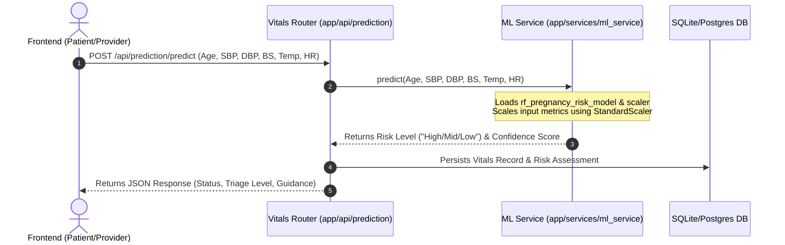
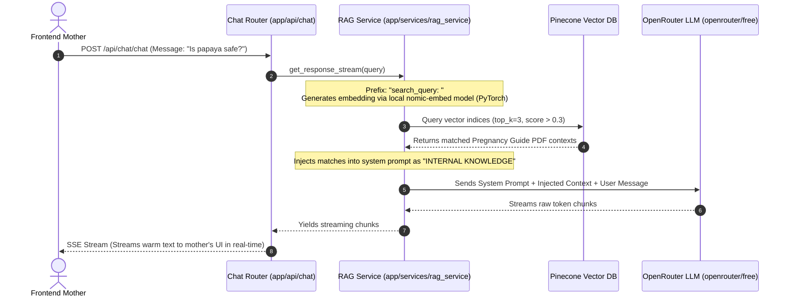

# MamaCare Backend: Architectural & Hosting Feasibility Audit

This document presents a comprehensive, read-only architectural analysis and hosting feasibility audit of the **MamaCare Backend** (`mamacare-backend`). It evaluates the software structural layers, data pipelines, computing bottlenecks, and deployment viability across various hosting models.

---

## 1. Executive Architectural Verdict
The `mamacare-backend` is built using a modern, industry-standard **FastAPI modular architecture**. The system cleanly segregates structural concerns into specialized layers, demonstrating excellent modularity, type-safety, and API routing paradigms.

However, the architecture contains a major **compute-resource mismatch** between the chosen local ML/RAG implementations (which rely on massive, high-overhead libraries like PyTorch and local SentenceTransformers) and typical cloud hosting targets (which are resource-constrained and ephemeral). 

To ensure hosting feasibility, the backend must undergo an **architectural optimization** to transition heavy local RAG components to remote APIs, as detailed below.

---

## 2. Structural & Architectural Analysis

The codebase is organized into highly structured, focused, and cohesive layers:

```
mamacare-backend/
├── app/
│   ├── api/          # Route Controllers (Auth, Admin, RAG, ML, Wellness)
│   ├── core/         # Core Configurations & Database Session Engines
│   ├── models/       # Declarative Database Models (SQLAlchemy)
│   ├── schemas/      # Input/Output Data Validators (Pydantic)
│   ├── services/     # Heavy Business Logic Modules (ML, RAG, OTP)
│   └── main.py       # FastAPI Application Bootstrap
```

### Layer Breakdown:
1. **API Routing Layer (`app/api/`):** Acts strictly as controller gates. They ingest HTTP requests, validate payloads against schemas, call the appropriate business services, and return structured JSON responses. This keeps endpoints clean and prevents logic leakage.
2. **Business Logic Layer (`app/services/`):** Separates core processes from the controllers.
   * `ml_service.py` abstracts Random Forest model loading (`mama_model_v2.joblib`) and processes vitals data scaling.
   * `rag_service.py` encapsulates local document embedding generation via `SentenceTransformer` and handles vector databases (Pinecone) and LLM streaming (OpenRouter).
   * `otp_service.py` manages one-time passwords and logs into SMTP services.
3. **Data Persistence Layer (`app/models/` & `app/core/database.py`):** Uses SQLAlchemy Declarative Base. Database connections are injected dynamically into route controllers via FastAPI’s Dependency Injection pattern (`Depends(get_db)`), ensuring thread-safe session opening and closing.
4. **Validation Layer (`app/schemas/`):** Uses Pydantic to enforce strict schema validation, type-safety, and JSON serialization. This forms a robust contract between the FastAPI backend and the React/Vite frontend.

---

## 3. Critical Data Flow Architectures

The backend supports two highly specialized analytical data flows: the **Machine Learning Vitals Triage pipeline** and the **Retrieval-Augmented Generation (RAG) Chatbot pipeline**.

### A. Machine Learning Vitals Triage Flow
Enforces rapid inference by taking 6 vital metrics, scaling them, and generating a triage risk classification.



### B. Retrieval-Augmented Generation (RAG) Chatbot Flow
Executes RAG by generating embeddings locally, querying a remote vector database, and streaming contextualized LLM responses.



---

## 4. Hosting Feasibility & Production Constraints

To select a cloud host, the backend's resource footprint must be carefully analyzed. The local PyTorch/SentenceTransformers RAG integration introduces major resource constraints:

| Hosting Paradigm | Feasibility | Key Advantages | Technical Bottlenecks & Critical Risks |
| :--- | :--- | :--- | :--- |
| **Ephemeral Containers**<br/>*(e.g., Render Free Tier, Railway, Heroku)* | **Low to Moderate**<br/>*(Without Refactoring)* | * Easy Git-integrated deployments.<br/>* Low-cost/Free tiers available.<br/>* Managed SSL and auto-scaling. | * **OOM Crash Risk:** Local `SentenceTransformer` requires **800MB - 1.2GB of RAM** on startup to load PyTorch and weights. Free tiers (limited to 512MB RAM) will **instantly crash due to Out-Of-Memory (OOM) errors**.<br/>* **Build Size/Timeouts:** Installing `torch` and HuggingFace caches creates a **1.5GB+ disk image**. Builds will likely exceed Render's 10-15 minute compile limit.<br/>* **Ephemeral SQLite:** If using SQLite (`mamacare.db`), all registered user and triage records are permanently deleted every time the container sleeps or restarts.<br/>* **Cold Starts:** Cold boots will take **45 - 90 seconds** while the container downloads model weights. |
| **Dedicated Cloud VMs**<br/>*(e.g., DigitalOcean Droplet, AWS EC2, Linode)* | **High** | * Persistent local storage SSD.<br/>* Access to OS swap space bypasses physical RAM limits.<br/>* Full control over system resources. | * Requires manual DevOps maintenance (setting up Nginx, SSL certificates, Systemd daemons, and firewalls).<br/>* Minimum $5–$12 monthly cost (no free tiers). |
| **Serverless Functions**<br/>*(e.g., AWS Lambda, Vercel Serverless)* | **Impossible**<br/>*(Without Refactoring)* | * Zero-cost idle times.<br/>* Scales instantly to thousands of mothers. | * Package size limits (AWS Lambda's 250MB limit) completely block PyTorch (`torch` alone is >200MB).<br/>* Catastrophic cold start latencies (loading ML libraries takes several seconds). |

---

## 5. Optimized "Hosting-Friendly" Strategy (Roadmap)

To ensure the backend can be deployed **entirely for free** on standard platforms like Render or Railway without crashes, we recommend the following architectural migration:

### Step 1: Migrate Local Embeddings to Cloud APIs
* **The Problem:** Local PyTorch (`torch`) and `sentence-transformers` represent 99% of your RAM and build size overhead.
* **The Solution:** Swap the local embedding model in `rag_service.py` to use a cloud embeddings API:
  * **Option A:** Pinecone's serverless embedding endpoints.
  * **Option B:** OpenAI's `text-embedding-3-small` API (which costs ~$0.00002 per 1k tokens, making it practically free).
* **Code Modification Concept (Read-Only Blueprint):**
  ```python
  # Old: (Loads PyTorch & downloads heavy local model files)
  # from sentence_transformers import SentenceTransformer
  # self.embedder = SentenceTransformer("nomic-ai/nomic-embed-text-v1.5")
  # return self.embedder.encode(text).tolist()

  # New: (Lightweight HTTP call, 0MB RAM overhead, executes in milliseconds)
  import openai
  response = openai.Embedding.create(
      input=[text],
      model="text-embedding-3-small"
  )
  return response['data'][0]['embedding']
  ```

### Step 2: Strip Heavy Dependencies from `requirements.txt`
Once Step 1 is implemented, you can safely remove the massive scientific and neural network packages from `requirements.txt`:
* **Remove:** `torch`, `sentence-transformers`, `transformers`, `scipy`, `safetensors`, `sympy`, `einops`, `mpmath`.
* **Impact:** 
  * Memory footprint drops from **1.2 GB to ~75 MB**.
  * Total build size drops from **1.5 GB to <15 MB**.
  * Render build time drops from **12 minutes to 45 seconds**.
  * Cold boot latency drops from **60 seconds to less than 1 second**.
  * **The backend becomes 100% stable on Render's Free tier!**

### Step 3: Implement Production Database Persistence
To prevent ephemeral disk wipes in production:
1. Provision a free PostgreSQL database (e.g., Neon DB, Supabase, or Render PostgreSQL).
2. Configure SQLAlchemy in [database.py](file:///c:/Users/linzs/Projects/MamaCare/mamacare-backend/app/core/database.py) to read from the dynamic environment variable:
   ```python
   import os
   DATABASE_URL = os.getenv("DATABASE_URL", "sqlite:///./mamacare.db")
   # Strip 'postgres://' if needed (for Heroku/Render compatibility)
   if DATABASE_URL.startswith("postgres://"):
       DATABASE_URL = DATABASE_URL.replace("postgres://", "postgresql://", 1)
   ```

---

## 6. Audit Summary

* **General Architecture Quality:** **Grade A.** The separation of concerns, Pydantic validations, and SQLAlchemy dependency injection are exceptionally clean and professional.
* **Hosting Feasibility (As-Is):** **Grade D.** Ephemeral containers will suffer from OOM crashes or build timeouts due to PyTorch and local SentenceTransformers.
* **Hosting Feasibility (Optimized):** **Grade A+.** Transitioning to a serverless cloud embeddings API removes the compute bottleneck, making the app highly stable, ultra-lightweight, and fully ready for zero-cost hosting.
